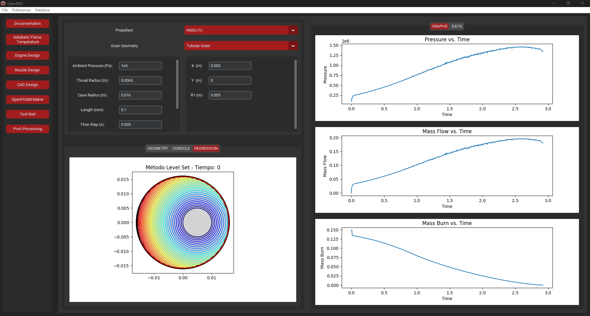

OpenRED - Rocketry Engine Designer
==========


Overview
--------

OpenRED is an open-source software designed to assist in the design of rocket engines for college rocketry teams. The software features various modules that enable a concurrent workflow in developing different engine and nozzle prototypes. From the chemical definition of the propellant to testing and data post-processing, OpenRED guides users through the logical design process of a solid propellant rocket engine.

Current Features:
* Definition of any propellant through its chemical reaction and adiabatic flame temperature calculation.
* Data bases for chemical components and propellants.
* Engine desing module with LSM (Level-Set Method) for burning regression calculation. Users can make their own grain geometry module and edit existing ones.
* Nozzle desing module which takes the designed engines as startpoint to draw the contours. Users can make their own nozzle solvers (limited to conventional bell shaped nozzles - aerospike soon).
* CAD Design Module that lets the user export a csv file which can be imported through [Sketcher to Fusion360](https://github.com/marcosflz/Fusion360-CSV-Sketcher)  to get a sketch of the engine and the propellant casting tools.
* Testing Module configured with WiFi ESP-32 modules that controls and receives data from a testing bench.

Planned Features:
* Easy OpenFoam folder manager configurator for CFD simulations.
* Post-Processing tools for each type of generated results file.
* IA predictor of testing bed propulsive results from analytic desing.


The calculations involved were sourced from Rocket Propulsion Elements by George Sutton and from [Richard Nakka's website](https://www.nakka-rocketry.net/rtheory.html) among many other sources.



Download and source
-------
You can download the latest version of the installer for your system [here](https://github.com/marcosflz/OpenRED/releases/tag/preview). The installer is made by inoSetup and the installations follows an easy wizard setup. Alternatively, you can run it from source code by downloading the zip file of the latest update or by git clone.

The program is currently being developed using python 3.12.4. The pip dependencies are included in `requirements.txt`. This project consists mainly of `CustomTkinter`, `Tkinter`, `numpy`, `scipy`. Front modules inlude the GUI design with customtkinter logic. The same way Back modules have all the methods implemented to get the results.

```
$ git clone https://github.com/marcosflz/OpenRED.git
```

Project and Working directory structures
-----------
The latest project structure consists of three main files and subfolders with the rest of modules.

```plaintext
src/                   
├── back_modules/      
│   ├── GrainLibrary   
│   ├── NozzleLibrary  
│   ├── __init_.py     
│   ├── back_0.py      
│   ├── back_1.py
│   └── back_2.py     
├── front_modules/     
│   ├── GrainLibrary   
│   ├── NozzleLibrary  
│   ├── __init_.py        
│   ├── front_adTemp.py       
│   ├── front_cad.py
│   ├── front_cfd.py 
│   ├── front_chemWin.py
│   ├── front_doc.py
│   ├── front_nozDes.py
│   ├── front_post.py
│   ├── front_propDes.py
│   ├── front_propWin.py
│   └── front_test.py
├── themes/
├── app.py
├── functions.py
├── imports.py
├── database.db
├── requirements.txt
└── icon.ico
```

After installation through setup wizard, the OpenRED directory would have this structure.

```plaintext
install_dir/                   
├── back_modules/         
├── front_modules/     
├── themes/
├── app.exe
├── database.db
├── icon.ico
├── unins000.dat
└── unins000.exe
```

The working directory consists of a folder for each export files of different modules and two `JSON` files for configuration and state-saving as well as for checklist construction for Testing-Module.

```plaintext
working_dir/                   
├── Engines/      
├── Nozzles/          
├── Sketches/     
├── Tests/ 
├── checklist.json
└── config.json
```

Data Files
-----------
OpenRED uses [JSON](https://en.wikipedia.org/wiki/JSON) for every module export file, configuration file and checklist file. At this stage the only exports which are not `JSON` comes from CAD-Module and Testing-Module. There is also a `.db` file for the chemical and propellant data but in the future it will be updated to get a `JSON` based software.


License and Contributing
-------
OpenRED is released under the GNU GPL v3 license. The source code is distributed so any user can update the software and improve it. Any suggestion will be welcome. Take in mind that all calculations have been revised but this process isn´t perfect.
